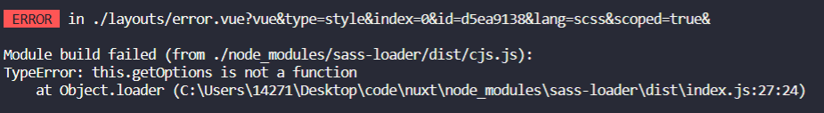
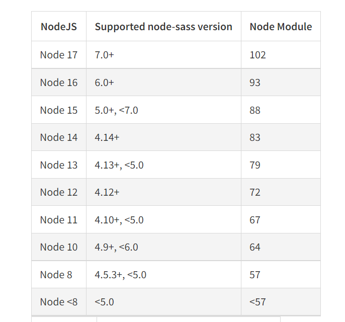

# TypeError: this.getOptions is not a function 的解决
### 一、问题图片

### 二. 问题的解决：
+ 这个实际上就是 sass-loader 的版本过高，不兼容 getOptions 函数方法，所以需要对 sass-loader 进行降级处理

+ 问题的解决：通过 npm uninstall sass-loader 命令卸载原版本的 sass-loader，然后 通过 npm install sass-loader@5.0.0 命令下载降级版本的 sass-loader，这个问题就可以解决了

### [三、node对应的node-sass对应的sass-loader](https://www.npmjs.com/package/node-sass)

例如：
node版本@16.14.2==>sass-loader@7.0.3==>node-sass@6.0.1

如果node不是最新版本，则需要安装对应的版本号才行
npm install sass-loader@版本号 node-sass@版本号 --save-dev //安装对应的版本

yarn add sass-loader@版本号 node-sass@版本号 -D //安装对应的版本