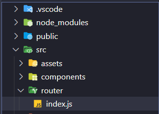
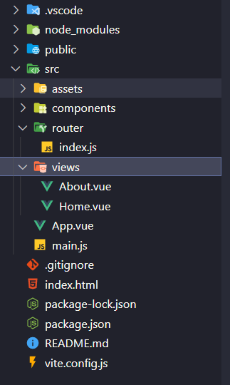

#### 一、安装vue-router
1 执行命令
```js
npm install vue-router@4 -S
```
2 项目目录src下新建router文件夹 在创建index.js



#### 二、配置src/router/index.js文件内容

```js
import { createRouter, createWebHistory } from "vue-router";
import Home from "../views/Home.vue";

const routes = [
  {
    path: "/",
    name: "Home",
    component: Home,
  },
  {
    path: "/about",
    name: "About",
    component: () =>
      import(/* webpackChunkName: "about" */ "../views/About.vue"),
  },
];

const router = createRouter({
  history: createWebHistory(),
  routes,
});

export default router;

```

#### 三、在src目录新建views/Home.vue和About.vue


 
>Home.vue和About.vue随便写入点内容即可

#### 四、App.vue文件内容修改

改为
```js
<template>
	<router-view />
</template>
```

#### 五、main.js挂载使用router

```js
import { createApp } from 'vue'
import App from './App.vue'
import router from "./router";

createApp(App).use(router).mount('#app')
```