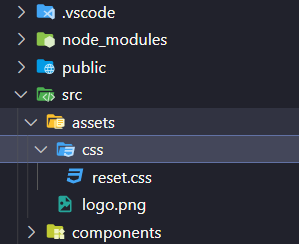

#### 一、全局配置别名
```js
// vite.config.js
import { defineConfig } from 'vite'
import vue from '@vitejs/plugin-vue'
const path = require('path')

export default defineConfig({
  plugins: [vue()],
  resolve:{
    //设置路径别名
    alias: {
      '@': path.resolve(__dirname, './src'),
      '*': path.resolve('')
      },
  },
})
```
#### 二、进入reset.css
> 网址： https://meyerweb.com/eric/tools/css/reset/ 

#### 三、reset.css放入项目中并在mainjs中引入
> src/assets/css/reset.css



引入

```js
//main.js
import { createApp } from 'vue'
import App from './App.vue'
import router from './router'

import '@/assets/css/reset.css'
import '@/assets/scss/index.scss'

createApp(App).use(router).mount('#app')
```

#### 四、创建头部组件
> components/common/Header.vue

代码：
```js
<template>
	<div>
		头部组件
	</div>
</template>
```
在Home.vue中引入
```js
	</div>
</template>

<script setup>
import Header from '../components/common/Header.vue'
</script>
```