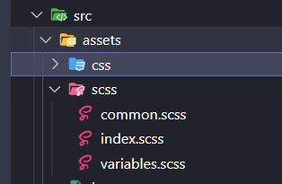
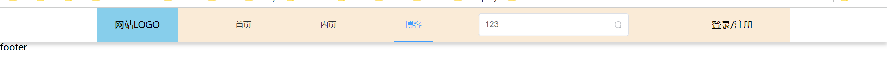

#### 一、进入element-ui官网
> 网址：https://element-plus.gitee.io/zh-CN/

#### 二、下载引入
1 下载
```js
npm install element-plus --save
```
2 自动导入
首先你需要安装unplugin-vue-components 和 unplugin-auto-import这两款插件
```js
npm install -D unplugin-vue-components unplugin-auto-import
```

然后把下列代码插入到你的 Vite中
```js
// vite.config.ts
import { defineConfig } from 'vite'
// ...
import AutoImport from 'unplugin-auto-import/vite'
import Components from 'unplugin-vue-components/vite'
import { ElementPlusResolver } from 'unplugin-vue-components/resolvers'

export default defineConfig({
  // ...
  plugins: [
    // ...
    AutoImport({
      resolvers: [ElementPlusResolver()],
    }),
    Components({
      resolvers: [ElementPlusResolver()],
    }),
  ],
})
```

3.将vue vue-router放入AutoImport中
```js
//vite.config.js

  plugins: [
        vue(),
        AutoImport({
            imports: ['vue', 'vue-router']
        })
    ],
//...

```
#### 三、安装sass
1 安装
```js
npm i sass sass-loader@7 node-sass@6 -D
```
2 创建scss文件夹及scss文件



3 mainjs中引入scss
```js
import '@/assets/scss/index.scss'
```
#### 四、头部布局代码

```js
//Header.vue
<template>
    <header class="header">
        <el-menu :default-active="activeIndex" class="contaier-xl el-header" mode="horizontal" :ellipsis="false"
            @select="handleSelect">
            <h1 class="logo">网站LOGO</h1>
            <el-menu-item index="1">首页</el-menu-item>
            <el-menu-item index="2">内页</el-menu-item>
            <el-menu-item index="3">博客</el-menu-item>
            <el-input v-model="inputValue"  placeholder="Please Input Content" class="el-input"  :suffix-icon="Search" />
            <div class="header-login my-text-center">登录/注册</div>
        </el-menu>
    </header>

</template>

<script  setup>
import {Search} from  '@element-plus/icons-vue'

const activeIndex = ref('1')
const inputValue = ref('')
const handleSelect = (key, keyPath) => {
    console.log(key, keyPath)
}
</script>

<style lang="scss" scoped>
//使用媒体查询使页面有最小版心
@media (min-width: 1240px) {
    .contaier-xl {
        background-color: antiquewhite;
        max-width: 1200px;
        width: 100%;
        margin: 0 auto;
    }
}

@media (max-width: 1200px) {
    .contaier-xl {
        background-color: red;
        min-width: 1200px;
    }
}

.header {
    min-width: 1200px;
    background: #fff;
    box-shadow: 0 5px 6px rgb(0 0 0 / 16%);
    position: relative;
    z-index: 10;
}

.el-header {
    display: flex;
    justify-content: space-between;
    align-items: center;
    height: 60px;
    line-height: 60px;

    .logo {
        width: 300px;
        background: skyblue;
        width: 140px;
        text-align: center;
    }
    .el-input{
        height:40px;
        width: 260px;
    }
}
</style>

```
> 以上代码中有用到element的图标
>
>图标使用拷贝就可以，但是记得import { xxx } from "@element-plus/icons-vue"